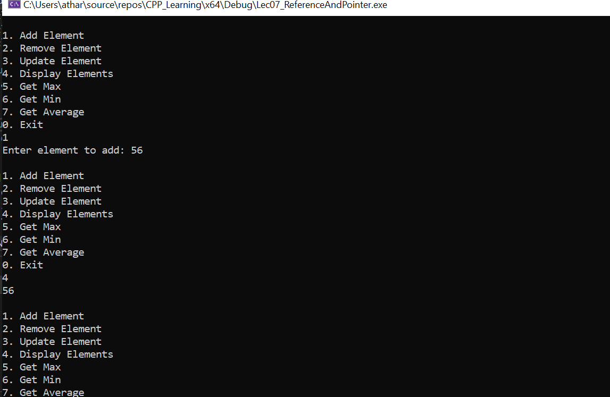

# Dynamic Array Operations

## 1. Problem Definition:
The project involves creating a dynamic array that can be resized as needed. The operations include:
1. Adding elements to the array.
2. Removing elements at a specific index.
3. Updating elements at a specific index.
4. Finding the maximum, minimum, and average values of the elements in the array.
5. Displaying the contents of the array.

The array is managed using pointers, and the memory is dynamically reallocated when necessary to accommodate more elements.

## 2. Solution:
1. **DynamicArray Class**: 
   - Manages a dynamic array of integers using pointers.
   - Includes methods for adding, removing, updating, resizing, and retrieving statistics like max, min, and average.
   - Resizes the array when its capacity is exceeded.

2. **Pointer Operations**: 
   - Memory is dynamically allocated and reallocated using pointers.
   - Efficient management of memory is achieved through resizing when the array reaches capacity.

3. **Main Function**: 
   - Provides a user menu to interact with the array.
   - Supports operations like adding, removing, updating, displaying elements, and calculating statistics (max, min, and average).

## 3. Approach:
- **Dynamic Memory Management**: The array is allocated dynamically using pointers, and memory is reallocated when needed.
- **Encapsulation**: All array operations are encapsulated within the `DynamicArray` class.
- **Resizing Logic**: The array automatically resizes when the number of elements exceeds its current capacity, ensuring the program can handle a growing dataset.

## 4. Learning:
- **Dynamic Memory Allocation**: Demonstrates the use of pointers to allocate, deallocate, and resize memory for an array.
- **Arrays and Pointers**: Illustrates the management of dynamic arrays through pointer manipulation.
- **Basic Data Operations**: Implements key operations on arrays, including adding, removing, updating, and calculating statistics.
- **Object-Oriented Programming (OOP)**: Uses classes and methods to structure code and encapsulate functionality for better maintainability and readability.

## 5. Output
