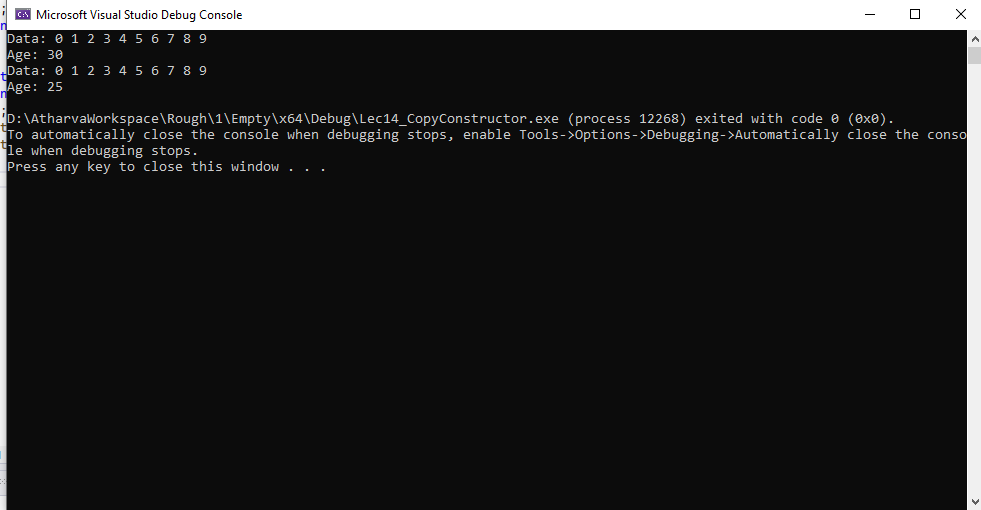

# Person Class: Shallow vs Deep Copy

## Problem Definition

Implement a `Person` class with a dynamic array and a mutable data member `age`. Write a shallow copy and deep copy constructor. Demonstrate the difference between the two types of copying, and modify the mutable member using a function.

## Solution

In this solution, a `Person` class is created. The class has a dynamic array to store integer data and a mutable `age` attribute. We implement both shallow and deep copy constructors to understand the difference. The `mutateAge` function is used to modify the `age` value.

## Approach

1. **Shallow Copy**: Only the pointer reference is copied, so both objects share the same memory.
2. **Deep Copy**: A separate memory block is allocated for the new object, so it is independent of the original.
3. **Mutable Data Members**: The `mutateAge` function demonstrates how the `mutable` keyword allows modifying data members, even in const member functions.

## Learning

- Shallow vs Deep Copy.
- Mutable Data Members in C++.
- Use of `#pragma once` to prevent multiple inclusions of header files.

## Output
