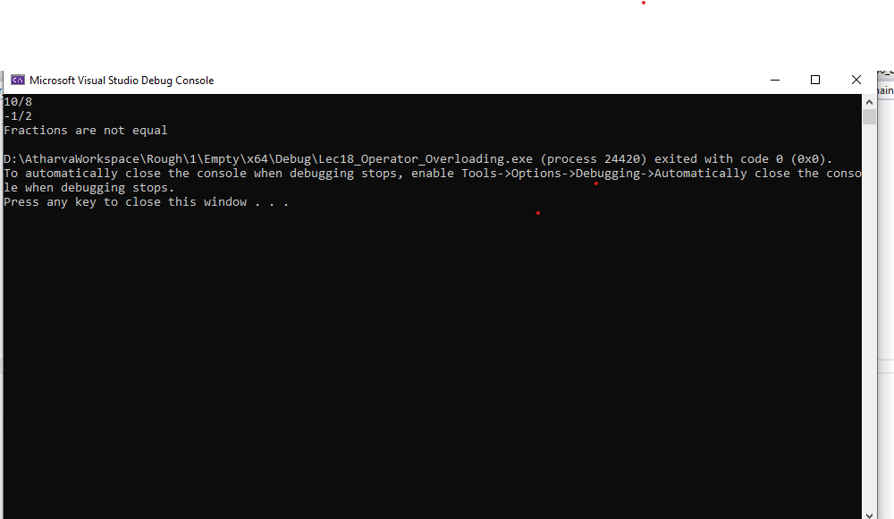

# Fraction Class Operations

## Problem Definition
This project implements a `Fraction` class that represents a fraction with a numerator and denominator. It provides functionality to add fractions, compare them for equality, and negate a fraction.

## Solution
The solution includes the creation of a `Fraction` class with overloaded operators for addition, equality comparison, and unary negation.

## Approach
1. Define a `Fraction` class with private members for the numerator and denominator.
2. Overload the `+` operator as a non-member function to add two fractions.
3. Overload the `==` operator as a non-member function to compare two fractions.
4. Overload the unary `-` operator to negate the fraction.
5. Implement a method to display the fraction.

## Output

