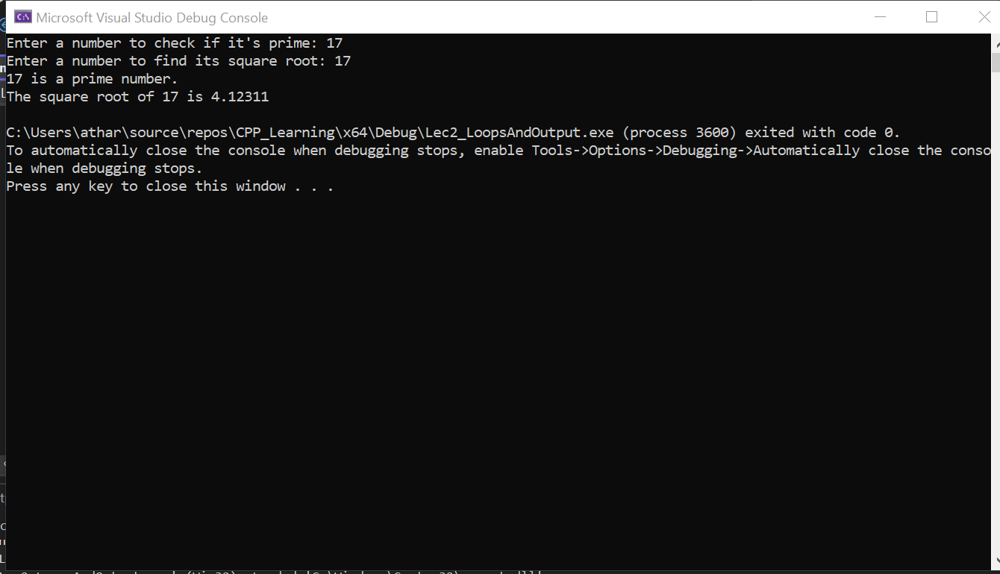

# Lecture 2 Loops and Output

## 1. Problem Definition:
The problem involves two tasks:
1. Checking if a number is prime.
2. Calculating the square root of another number.

It requires handling input/output, making use of functions and standard libraries like `<cmath>`, and applying logical operations.

## 2. Solution:
1. **Prime Checking:** We implemented a `PrimeChecker` class that includes the `isPrime` method to check whether a number is prime.
2. **Square Root Calculation:** The `<cmath>` library is used to compute the square root of the second input number.
3. **Output:** The program outputs whether the first number is prime and the square root of the second number.

## 3. Learning:
- **Input/Output Handling:** Demonstrates basic handling of user inputs with `cin` and outputs with `cout`.
- **Prime Number Check:** A method inside the `PrimeChecker` class checks whether the number is prime using a loop.
- **Math Library (`cmath`):** Utilizes the standard math library for square root calculations.
- **Object-Oriented Programming (OOP):** Demonstrates the use of a class and object in C++ for modular design.

## 4. Screenshot

