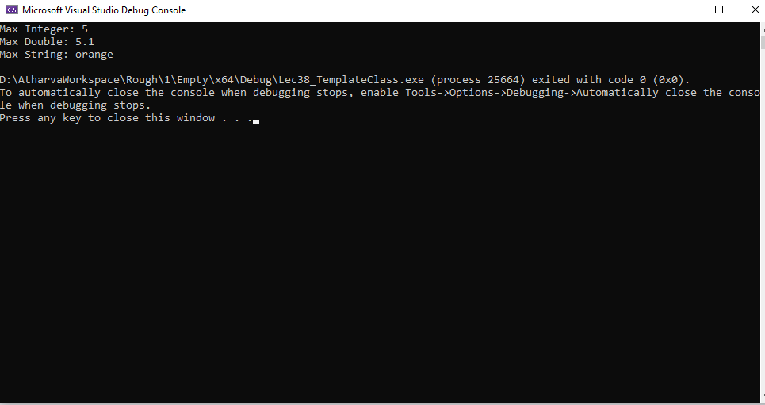

# Template-Based Maximum Finder

## Problem Definition
This project implements a `MaxFinder` class template that can find the maximum value from a list of items of any data type, including integers, doubles, and strings. The objective is to demonstrate the use of function templates and class templates in C++.

## Solution
The solution includes the `MaxFinder` class template that provides a method to find the maximum value among a list of items. The method utilizes template argument deduction to allow for various data types.

## Approach
1. **Define the `MaxFinder` Class Template**: 
   - Contains a method `findMax` that takes an initializer list of type `T` and returns the maximum value.
   
2. **Implement the `findMax` Method**:
   - Initializes the maximum value from the first element in the list.
   - Iterates through the list to compare and update the maximum value as needed.

3. **Demonstrate Functionality in `main.cpp`**:
   - Create instances of `MaxFinder` for different data types (int, double, string).
   - Call the `findMax` method with initializer lists and display the results.

## Learning
Through this project, I learned how to:
- Utilize function templates and class templates to create reusable components in C++.
- Implement template argument deduction for flexibility with different data types.
- Understand the importance of templates in enabling type-safe generic programming.

## Output
