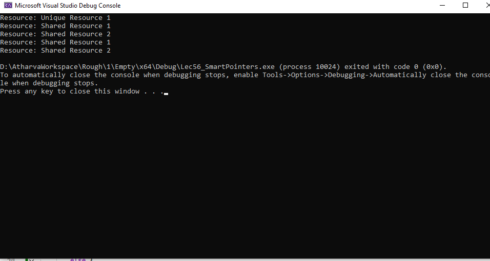

# Smart Pointer Resource Manager

## Problem Definition
This project implements a `ResourceManager` class that manages resources using different types of smart pointers: `unique_ptr`, `shared_ptr`, and `weak_ptr`. The goal is to demonstrate resource management and the behavior of these smart pointers.

## Solution
The solution includes the creation of a `Resource` class and a `ResourceManager` class that handles adding and displaying resources. Resources are managed using smart pointers to ensure automatic memory management.

## Approach
1. Define a `Resource` class that encapsulates a resource name.
2. Define a `ResourceManager` class that manages collections of resources with different smart pointers.
3. Implement methods to add unique and shared resources.
4. Implement a method to display all resources, handling weak references appropriately.

## Learning
Through this project, I learned about the different types of smart pointers in C++, including how to use `unique_ptr`, `shared_ptr`, and `weak_ptr` for effective resource management. I also explored the implications of ownership and memory safety when using these smart pointers.

## Output
