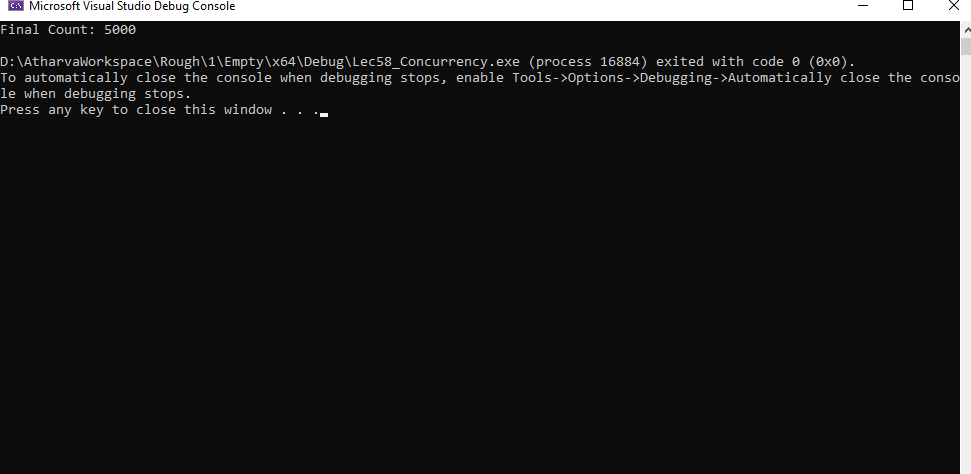

# Thread Safe Counter

## Problem Definition
This project implements a `Counter` class that manages a count value, allowing it to be incremented safely from multiple threads. The goal is to demonstrate the use of threads and synchronization mechanisms in C++ to avoid race conditions.

## Solution
The solution includes a `Counter` class that maintains a count and provides methods to increment and retrieve the count safely using `std::mutex` for synchronization. The main function creates multiple threads that increment the count concurrently.

## Approach
1. **Define the `Counter` Class**: 
   - Contains a private integer `count` and a `std::mutex` for synchronization.
   - Provides an `increment` method that safely increments the count.
   - Provides a `getCount` method to retrieve the current count.

2. **Thread Management**:
   - Define a function `incrementCounter` that increments the counter a specified number of times.
   - Create multiple threads using `std::thread` and `std::bind` to bind the counter and incrementing times.
   - Join all threads to ensure they complete before proceeding.

3. **Display the Result**: 
   - After all threads have finished executing, display the final count.

## Learning
Through this project, I learned how to:
- Utilize `std::thread` and `std::mutex` for concurrent programming in C++.
- Manage shared data safely to prevent race conditions and data races.
- Apply synchronization techniques such as mutual exclusion to ensure thread safety.

## Output
